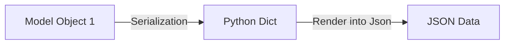
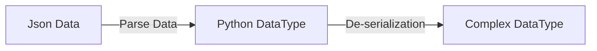

# Django Rest Framework (DRF)

## Application Programming Interface
- works as intermediary software 
- is a set of rules & instructions that allows different software applications to communicate and exchage data without giving access to database or backend logic.
- **Example:** Ecommerce app/website use API to connect with a payment gateway, allowing customers to make online payment.

**Client-Server Scenario**
- Client --> Sends requests (mobile app, browser)
- Server --> Processes requests, talks to DB, returns responses (code logic runs here)
- Database --> Stores raw data (products, users, orders, etc.)

**How Web API Works ?**
- Client makes HTTP Requests to API
- API will communicate to Web App/Database (if needed)
- Web App/DB provides required data to API
- API returns data to Client (in JSON/XML)

## REST (Representational State Transfer)
- is a set of rules/archireture style for designing/develop web APIs.

### REST API
- AN API that follows REST principle or is developed using REST.
- It allows clients (like mobile, browsers) to interact with servers using HTTP requests (POST, GET, PUT/PATCH, DELETE).

## DRF (Django Rest Framework)
- It is a powerful and flexible toolkit for building Web APIs.
- Python JSON: python has a built-in package called json, which is used to work with json data.
	- json.dumps(data): Convert Python dict → JSON string format, because APIs accept JSON. e.g., {'name': 'tayyab'} -> {"name": "tayyab"}
	- json.loads(data): parses a JSON-formatted string and converts it into a corresponding Python dictionary or list.

## Serializers
- is the **tool** or **class** that performs serialization/deserialization.

### Serialization
Serializers are responsible for converting complex data such as querysets and django model instances, into python data types (called serialization) that can be easily be rendered into JSON, XML or other content types which is understandable by front end.

**JSONRenderer**: used to render serialized data into JSON which is understandable by Front End.


```python
stu = Student.objects.get(id=1)  # complex DataType
serializer = StudentSerializer(stu)  # converts into python DT
json_data = JSONRenderer().render(serializer.data) # pass the dictionary into your serializer for validation.
```
### DeSerialization
Serializers also provide deserialization, allowing parsed data to be converted back into complex types, after first validating the incoming data.



**JSONParser()**: Converts JsonData to python DataType for validation and saving to database.

**Scenario / Data Flow Summary**

**`thirdpartyapp.py`**
Creates data ➝ converts to JSON ➝ sends POST request ➝ receives JSON response
    
**`views.py`**
 Receives JSON ➝ parses to Python ➝ validates ➝ saves to DB ➝ returns JSON success

**`serializers.py`**
Defines validation rules ➝ defines how to save data to DB when valid

## Validators
- are functions or classes used to check if data meets certain rules before saving it to the database or processing it.
- **Types**:
	 1. Field-level: validate only 1 field. e.g., def validate_fieldname()
	 2. Object-level: validate multiple fields together. e.g., def validate(self, data)
	 3. Custom function: e.g., validators=[validate_func] 
	 
```python
# Object-level validators
def validate(self, data):
    if data['roll'] == 0 and data['city'] == "Nowhere":
        raise serializers.ValidationError("Invalid combination")
    return data
```

## Class Based APIView
- sub-class of django's view class
- request passed to the handler methods will be REST Frameworks Request instances, not Django's HttpRequest instances.

## Mixins
- provide reusable behavior (like create, retrieve, update, delete)
- Used with `GenericAPIView` to build views with minimal code.    
- Each Mixin handles a specific HTTP action (like GET, POST).

**Common DRF Mixins**
	-   `CreateModelMixin` → Adds **POST** (create) support
	-   `ListModelMixin` → Adds **GET (list)** support

**How They're Used**
```python
from rest_framework.generics import GenericAPIView 
from rest_framework.mixins import ListModelMixin
class  StudentListView(GenericAPIView, ListModelMixin):
    queryset = Student.objects.all()
    serializer_class = StudentSerializer 
    def  get(self, request): 
	    return self.list(request)`
```

## Concrete View Classes
-   Pre-built classes combining **mixins** + `GenericAPIView`.
- Provide ready-to-use views for **common CRUD operations**.
- Require only a `queryset` and `serializer_class`.

**Common Concrete View Classes**
- `ListAPIView` → **GET (list)** all objects
- `ListCreateAPIView` → **GET (list)** + **POST (create)**

**Example**
```python
from rest_framework.generics import ListCreateAPIView
class StudentListCreateView(ListCreateAPIView):
    queryset = Student.objects.all()
    serializer_class = StudentSerializer
```

## ViewSets
- groups multiple related views (CRUD) into a single class. 
-  Replaces multiple views like `ListAPIView`, `CreateAPIView`, etc.
-  Works with routers to automatically generate URLs.
    
**Common ViewSet Types**
-   `ViewSet` → Base class (you define all actions manually)
-   `GenericViewSet` → Combine with mixins for flexibility
-   `ModelViewSet` → Full CRUD (create, retrieve, update, delete) with one class

**Example**
```python
# views.py
from rest_framework.viewsets import ModelViewSet
class StudentViewSet(ModelViewSet):
    queryset = Student.objects.all()
    serializer_class = StudentSerializer
    
# urls.py:
from rest_framework.routers import DefaultRouter
router = DefaultRouter()
router.register('students', StudentViewSet, basename='students')
# Automatically generates URLs for list, create, retrieve, update, delete.
```

## Authentication 
It is the process of verifying the identity of a user or client making a request to the API.
**Purpose**:
- Ensures that only authorized users can access protected resources.
- Identifies _who_ is making the request.

**Common authentication classes in DRF**:
- `SessionAuthentication`: Uses Django's session framework (suitable for web browsers).
- `BasicAuthentication`: Uses HTTP basic auth (mainly for testing).        
- `TokenAuthentication`: Uses a token in the header (ideal for APIs).     
- `JWTAuthentication`: Uses JSON Web Tokens for secure, stateless auth.
        
**Set via** `DEFAULT_AUTHENTICATION_CLASSES` in `settings.py`.

## Permissions
It control _what actions_ an authenticated (or unauthenticated) user is allowed to perform on a resource. Permissions checks are always run at very start of the view (after authentication) before any other code is allowed to proceed.
-   **Why we use it in DRF**:
	-   To restrict access to views based on user roles, ownership, or custom logic.
	 -   To protect resources from unauthorized operations even after authentication.

-   **Common permission classes in DRF**:
    -   `AllowAny`: No restrictions (any user can access).
    -   `IsAuthenticated`: Only authenticated users can access.
    -   `IsAdminUser`: Only admin users can access.
    -   `IsAuthenticatedOrReadOnly`: Authenticated users can write; anyone can read.
	- `DjangoModel Permissions`: give permissions to the users to post, update, delete from admin panel.
	- `DjangoModelPermissionsOrAnonReadOnly`: It allows unauthorized users to view data.
	-  `Custom permissions`: Defined by overriding has_permission or has_object_permission. The methods should return True if request have granted access, otherwise False.

-   **Set via** `permission_classes` in views or globally in `settings.py`.

## Token Authentication
It uses a simple HTTP authentication token-based scheme.
- Good for client-server setups (mobile clients)
- Add `rest_framework.authtoken` in INSTALLED_APPS.
- Make sure to run `migrate` command.
- The http command line tool may be useful for testing token auth APIs.


## Filters

It allows clients to narrow down query results  by specific field values (e.g., /api/posts/?author=admin).

 - Improves API usability by letting clients retrieve only relevant data.
 - Simplest way to filter queryset of any view that subclasses GenericAPIView is to override the .get_queryset() method.
 - django-filter package includes a DjangoFilterBackend class for field filtering.
 - `search_fields` allows keyword-based search across specified model fields using the `?search=` query parameter.
 - `OrderingFilter` allows clients to sort query results by specified fields using the `?ordering=` query parameter.

```python
from .models import  Student
from .serializers import  StudentSerializer
from rest_framework.generics import  ListAPIView
from django_filters.rest_framework import  DjangoFilterBackend
from rest_framework.filters import  SearchFilter, OrderingFilter

class  ListStudents(ListAPIView):
	queryset  =  Student.objects.all()
	serializer_class  =  StudentSerializer
	# filter_backends  = [DjangoFilterBackend]
	# filterset_fields  = ['city', 'name']
  
	filter_backends  = [SearchFilter]
	search_fields  = ['city', 'passby']
	
	filter_backends  = [OrderingFilter]
	ordering_fields  = ['name', 'city']

	# def get_queryset(self):
	# user = self.request.user    # gets current login user
	# return Student.objects.filter(passby=user)
```

## Pagination

It breaks large querysets into smaller, manageable pages to improve performance and user experience.
- Reduces response size and load time.

**Types:**
- PageNumberPagination: Splits results by page number. (Uses `?page=1`, `?page=2`, etc.)
- LimitOffsetPagination: Uses `?limit=10&offset=20` to control result size and starting point. (limit is same as of page_size in page_no_pagination)
- CursorPagination: Only presents forward and reverse controls, and does not allow client to navigate to arbitrary positions.

```python
from rest_framework.pagination import  PageNumberPagination

class  MyPageNumberPagination(PageNumberPagination):
page_size = 5  # no of records a page shows
page_query_param = 'p'
page_size_query_param = 'records'  # allows users to choose no of records
max_page_size = 8  # max no of records in a page

class ListStudents(ListAPIView):
    queryset = Student.objects.all()
    serializer_class = StudentSerializer
	pagination_class = MyPageNumberPagination
```

## Serializer Relations

Serializer relations are used to represent relationships (e.g., ForeignKey, ManyToMany) between models in serialized data.

**Usage:**
 - To properly serialize and deserialize related model data.
 - To represent nested or linked objects in a clear and reusable way.
 - To support relational integrity and navigation in APIs.
 
 **Types:**
- PrimaryKeyRelatedField: Shows related object by its primary key.
- StringRelatedField: Uses the model’s `__str__()` method. (Read only)
- SlugRelatedField: Uses a specific slug field instead of ID. (Read or Write)
- HyperlinkedRelatedField: Returns a hyperlink to the related object’s detail view.
- Nested Serializers: Embeds full object data using another serializer.

```python
# models.py:
class Singer(models.Model):
	name = models.CharField(max_length=50)
	gender = models.CharField(max_length=10)
	
class Song(models.Model):
	title = models.CharField(max_length=50)
	singer = models.ForeignKey(Singer, on_delete=models.CASCADE, related_name='song') # will use related_name in SingerSerializer class
	duration = models.IntegerField()

# serializer.py:
class SingerSerializer(serializers.ModelSerializer):
	# song = serializers.StringRelatedField(many=True, read_only=True)
	# song = serializers.PrimaryKeyRelatedField(many=True, read_only=True)
	# song = serializers.HyperlinkedRelatedField(many=True, read_only=True, view_name='song-detail')
	# song = serializers.SlugRelatedField(many=True, read_only=True, slug_field='title')
	song = serializers.HyperlinkedIdentityField(view_name='song-detail')

	class Meta:
		model = Singer
		fields = ['id', 'name', 'gender', 'song']

class SongSerializer(serializers.ModelSerializer):
	class Meta:
		model = Song
		fields = ['id', 'title ', 'singer', 'duration']

# views.py:
class SingerViewSet(viewsets.ModelViewSet):
	queryset = Singer.objects.all()
	serializer_class = SingerSerializer

class SongViewSet(viewsets.ModelViewSet):
	queryset = Song.objects.all()
	serializer_class = SongSerializer
```
```python
# HyperLinked Model Serializer
class StudentSerializer(serializers.HyperlinkedModelSerializer):
    class Meta:
        model = Student
        fields = ['id', 'url', 'name', 'roll', 'city']
```
---------------------------

```
