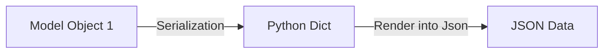
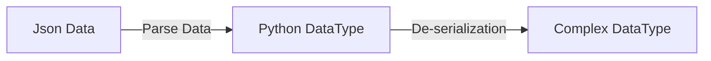

# Django REST Framework (DRF) Notes

These are beginner-friendly, well-organized notes on Django REST Framework (DRF) — useful for quick reference, interviews, and project implementation.

----------


## 🔁 Topics Covered
| # | Topic | Description | 
|--|--|--|
| 1 | [Application Programming Interface](#-application-programming-interface) | Basic API intro & client-server overview |
| 2 | [REST & REST APIs](#-rest-representational-state-transfer) | REST principles and HTTP methods |
| 3 | [Django REST Framework](#-what-is-drf) | What is DRF and why it's used |
| 4 | [Serializers](#-1-serializers) | Convert complex data to JSON and vice versa |
| 5 | [Validators](#️-2-validators) | Validate input data (field-level, object-level) |
| 6 | [APIView](#️-3-apiview-basic-view-class) | Base view class in DRF |
| 7 | [GenericAPIView + Mixins](#-4-genericapiview--mixins) | Reusable CRUD logic via mixins |
| 8 | [Concrete Generic Views](#-5-concrete-generic-views) | Prebuilt views for common CRUD operations |
| 9 | [ViewSets & Routers](#️-6-viewsets) | Combine multiple views in a single class |
| 10 | [Authentication](#-7-authentication) | Verify user identity |
| 11 | [Permissions](#-8-permissions) | Restrict access based on rules/roles |
| 12 | [Token Authentication](#-9-token-authentication) | Token-based login (basic DRF token auth) |
| 13 | [HttPie](⚙️#-httPie) | Testing APIs |
| 14 | [JSON Web Tokens (JWT)](#-10-json-web-tokens-jwt) | Secure stateless authentication via tokens |
| 15 | [Throttling](#-11-throttling) | Limit number of requests (rate-limiting) |
| 16 | [Filters](#-12-filters) | Search/filter data dynamically via URL |
| 17 | [Pagination](#-13-pagination) | Break large datasets into pages |
| 18 | [Serializer Relations](#-14-serializer-relations) | Handle ForeignKey/related data in serializers |


## 📡 Application Programming Interface

An **API** is a set of rules that allows different software applications to communicate without exposing backend logic or database structure.

**Example:** An e-commerce app uses an API to connect with a payment gateway, allowing customers to make online payments.

### 🔄 Client-Server Scenario

-   **Client** → Sends HTTP requests (e.g., browser/mobile app)
    
-   **Server** → Processes request, interacts with DB, returns a response
    
-   **Database** → Stores raw data (products, users, etc.)
    

### 🌐 How Web APIs Work

- Client makes HTTP Requests to the API

- API will communicate to Web App/Database (if needed)

- Web App/DB provides required data to API

- API returns data to Client (in JSON/XML)


## 🌍 REST (Representational State Transfer)

REST is an architecture style for designing/developing web APIs that uses standard HTTP methods for communication.

### ✅ REST API

An API that follows REST principles or is developed using REST. It allows clients (like mobile devices, browsers) to interact with servers using HTTP requests 

**Supported HTTP Methods:**

-   `GET` → Retrieve data
    
-   `POST` → Create data
    
-   `PUT/PATCH` → Update data
    
-   `DELETE` → Remove data


## 📦 What is DRF?

Django REST Framework (DRF) is a powerful and flexible toolkit for building Web APIs in Django.

----------

# 🎯 Core Components

## 🧩 1. Serializers

Serializers allow complex data (e.g., QuerySets) to be converted to native Python data types (called serialization) and rendered as JSON/XML or other content types which is understandable by front end and vice versa (deserialization).

### Example:

```python
# serializers.py
from rest_framework import serializers

class StudentSerializer(serializers.Serializer):
    name = serializers.CharField(max_length=100)
    roll = serializers.IntegerField()

# views.py
def post(self, request):
    serializer = StudentSerializer(data=request.data)
    if serializer.is_valid():
        # Process the validated data (e.g., save to DB)
        return Response({'msg': 'Data received'})
    return Response(serializer.errors, status=400)
```

-   `.data` → Returns validated data in dictionary format.
    
-   `.is_valid()` → Validates the data.
    
-   `.errors` → Returns validation errors.
    
-   `.validated_data` → Access the cleaned, valid data.
----------

## 🔁 Serialization Flow



**JSONRenderer**: used to render serialized data into JSON which is understandable by Front End.

### Example
```python
stu = Student.objects.get(id=1)  # complex DataType
serializer = StudentSerializer(stu)  # converts into python DT
json_data = JSONRenderer().render(serializer.data) # pass the dictionary into your serializer for validation.
```
---------

## 🧩 DeSerialization

Serializers also provide deserialization, allowing parsed data to be converted back into complex types, after first validating the incoming data.

### 🔁 Deserialization Flow



**JSONParser()**: Converts JSON data to python DataType for validation and saving to database.

**Scenario / Data Flow Summary**

**`thirdpartyapp.py`**
Creates data ➝ converts to JSON ➝ sends POST request ➝ receives JSON response
    
**`views.py`**
 Receives JSON ➝ parses to Python ➝ validates ➝ saves to DB ➝ returns JSON success

**`serializers.py`**
Defines validation rules ➝ defines how to save data to DB when valid

--------


## 🛡️ 2. Validators

are functions or classes used to check if data meets certain rules before saving it to the database or processing it.

**Types**:
- `Field-level`: validate only 1 field. e.g., *def validate_fieldname()*

-  `Object-level`: validate multiple fields together. e.g., *def validate(self, data)*

-  `Custom function`: Passed to validators=[validate_func] 
	 
### Example (Object-level):
```python
# Object-level validators
def validate(self, data):
    if data['roll'] == 0 and data['city'] == "Nowhere":
        raise serializers.ValidationError("Invalid combination")
    return data
```
-------

## ⚙️ 3. APIView (Basic View Class)
Inherits from Django's `View`, but provides DRF’s features like request parsing and Response handling.

### Example:

```python
from rest_framework.views import APIView
from rest_framework.response import Response

class StudentAPI(APIView):
    def get(self, request):
        return Response({'msg': 'GET request'})
    
    def post(self, request):
        return Response({'msg': 'POST request'})
```
----------


## 🔄 4. GenericAPIView + Mixins

DRF provides generic views that can be combined with mixins to simplify CRUD operations. Each Mixin handles a specific HTTP action (like GET, POST).

### Example:

```python
from rest_framework.generics import GenericAPIView
from rest_framework.mixins import ListModelMixin, CreateModelMixin

class StudentListCreateAPI(GenericAPIView, ListModelMixin, CreateModelMixin):
    queryset = Student.objects.all()
    serializer_class = StudentSerializer

    def get(self, request):
        return self.list(request)

    def post(self, request):
        return self.create(request)
```
----------


## 🧱 5. **Concrete Generic Views**

These are shortcuts combining `GenericAPIView` + relevant mixins.

| View | Description |
|--|--|
| `ListAPIView` | Read-only list of objects |
| `CreateAPIView` | Create new object |
| `RetrieveAPIView` | Retrieve single object |
| `UpdateAPIView` | Update existing object |
| `DestroyAPIView` | Delete object |
| `ListCreateAPIView` | List and create |
| `RetrieveUpdateDestroyAPIView` | Retrieve, update, delete |
----------


## 🗂️ 6. ViewSets

ViewSets group multiple related views (GET, POST, PUT, DELETE) into a single class, requiring less code and working with routers to automatically generate URLs.

### Types:

- `ViewSet` → Base class (you define all actions manually)
- `GenericViewSet` → Combine with mixins for flexibility
- `ModelViewSet` → Full CRUD (create, retrieve, update, delete) with one class

### Example:

```python
from rest_framework import viewsets

class StudentViewSet(viewsets.ModelViewSet):
    queryset = Student.objects.all()
    serializer_class = StudentSerializer
```

### Registering with Routers:

```python
#urls.py
from rest_framework.routers import DefaultRouter
from .views import StudentViewSet

router = DefaultRouter()
router.register('students', StudentViewSet)

urlpatterns = [
    path('', include(router.urls))
]
```
----------


## 🔐 7. Authentication

Authentication is the process of verifying the identity of a user or client making a request to the API.

**Purpose:**

- Confirms _who_ is making the request.
- Ensures that only authorized users can access protected resources.


**Common authentication classes in DRF:**

-   `SessionAuthentication`: Uses Django's session framework (browser-based clients).
    
-   `BasicAuthentication`: Uses HTTP basic auth (mostly for testing).
    
-   `TokenAuthentication`: Validates using tokens in the HTTP header.
    
-   `JWTAuthentication`: Uses JSON Web Tokens for secure, stateless authentication.
    

**Configured via:**  
`DEFAULT_AUTHENTICATION_CLASSES` in `settings.py`

-----


## ✅ 8. Permissions

Permissions control _what actions_ an authenticated or unauthenticated user can perform on a resource. Permissions checks are always run at very start of the view (after authentication) before any other code is allowed to proceed.

**Purpose:**

-   To restrict access to views based on user roles, ownership, or custom logic.
    
-   Restrict operations (e.g., create/update/delete) even after authentication.
    
    
**Common permission classes:**

-   `AllowAny`: No restrictions (open access).
    
-   `IsAuthenticated`: Only logged-in users can access.
    
-   `IsAdminUser`: Only admin/superuser access.
    
-   `IsAuthenticatedOrReadOnly`: Read for everyone, write for authenticated users.
    
-   `DjangoModelPermissions`: Grants permissions defined in Django Admin (add/change/delete).
    
-   `DjangoModelPermissionsOrAnonReadOnly`: Allows anonymous users to read.
    
-   `Custom permissions`: Define by overriding `has_permission()` or `has_object_permission()`.
    

**Configured via:**

-   `permission_classes` in views
    
-   Or globally via `DEFAULT_PERMISSION_CLASSES` in `settings.py`
----------


## 🔑 9. Token Authentication
A simple token-based scheme used for authenticating users.

**Features:**

-   Stateless and ideal for APIs (especially mobile clients).
    
-   Requires `rest_framework.authtoken` in `INSTALLED_APPS`.
    
-   Run `python manage.py migrate` after adding the app.
    

### 🔧 Token Generation Methods:

1.  **Admin Panel** – Add manually via Django admin.
    
2.  **Command Line** 
	> python manage.py drf_create_token <username>

3.  **Exposing an endpoint:** - By user itself

```python
from rest_framework.authtoken.views import obtain_auth_token
path('gettoken/', obtain_auth_token)
```    

### Example:
> http POST http://127.0.0.1:8000/gettoken/ username="user" password="pass"
    
4. **Using Signals:**  
    Automatically generate a token on user creation:
    
```python
from django.db import models
from django.conf import settings
from django.dispatch import receiver
from django.db.models.signals import post_save
from rest_framework.authtoken.models import Token

class  Student(models.Model):
	name = models.CharField(max_length=50)
	roll = models.IntegerField()
	city = models.CharField(max_length=50)

# This signal creates Authentication token for Users
@receiver(post_save, sender=settings.AUTH_USER_MODEL)
def  create_auth_token(sender, instance=None, created=False, **kwargs):
	if  created:
		Token.objects.create(user=instance)
```


## ⚙️ HttPie

A command-line tool for testing APIs (alternative to `curl` or Postman).

### Why use it?

-   Simple syntax for GET, POST, PUT, DELETE
    
-   Clear output for debugging responses
    
-   Great for quick terminal-based testing
    
### Example usage:
> http GET http://127.0.0.1:8000/api/students/
 

## 🔐 10. JSON Web Tokens (JWT)

JWT is a compact, URL-safe token format used to securely transmit information between parties as a JSON object. Unlike the built-in TokenAuthentication scheme, it doesn't need to use a database to validate a token.

**Install:**
> pip install djangorestframework-simplejwt

### 🔄 How JWT Works:

1.  User logs in → Server returns `access` & `refresh` tokens.
    
2.  Client stores tokens (e.g., `localStorage`).
    
3.  Each API request includes the access token in the header.
    
4.  Server validates the token's signature to authenticate the user.
    

### ⏱️ Configure Token Lifetime:
```python
# settings.py
from datetime import timedelta

SIMPLE_JWT = {
    'ACCESS_TOKEN_LIFETIME': timedelta(minutes=5),
    'REFRESH_TOKEN_LIFETIME': timedelta(days=1),
}
```

### 🔁 Token Renewal Flow:

1. User logs in → Gets both `access` and `refresh` tokens.

2. Access token expires after a few minutes.

3. Client sends a POST request to `/api/token/refresh/`** with the refresh token:
 
> http
> POST /api/token/refresh/
    {
      "refresh": "your_refresh_token_here"
    }
   
4.  Server responds with a new access token.

### 🔌 JWT Endpoints (SimpleJWT):

```python
# urls.py
from rest_framework_simplejwt.views import TokenObtainPairView, TokenRefreshView, TokenVerifyView

urlpatterns = [
    path('gettoken/', TokenObtainPairView.as_view(), name="tokenobtainpair"),
	path('refreshtoken/', TokenRefreshView.as_view(), name="tokenrefresh"),
	path('verifytoken/', TokenVerifyView.as_view(), name="tokenverify"),
]
```

### CLI Examples with `httpie`:

1)   🔐 Get tokens: Get Access & Refresh tokens 
> http POST http://127.0.0.1:8000/gettoken/ username="user" password="pass"

2)   ✅ Verify token: Check if token is valid
> http POST http://127.0.0.1:8000/verifytoken/ token="your_access_token"

3)   🔁 Refresh token:  Get new Access token
> http POST http://127.0.0.1:8000/refreshtoken/ refresh="your_refresh_token"
-------------------


## 🚦 11. Throttling

Throttling limits the number of API requests a user or client can make to an API in a given time period.

### ✅ Why Use Throttling?

- Prevent *abuse* or *overuse* of the API (e.g., spamming or DoS attacks).
- Ensure *fair usage* among multiple users. 
- Protect server resources and maintain performance.
        
### 🛠️ DRF Throttle Classes

1)  `AnonRateThrottle`: Limits requests from *unauthenticated users*.
2)  `UserRateThrottle`: Limits requests from *authenticated users*.
3) `ScopedRateThrottle`: Restrict access to specific parts of the API (views/actions).

### ⚙️ Configuration in `settings.py`:

```python
REST_FRAMEWORK = {
    'DEFAULT_THROTTLE_CLASSES': [
        'rest_framework.throttling.AnonRateThrottle',
        'rest_framework.throttling.UserRateThrottle',
    ],
    'DEFAULT_THROTTLE_RATES': {
        'anon': '10/hour',
        'user': '100/day',
    }
}
```

### Example

```python
# views.py
from rest_framework.views import APIView
from rest_framework.response import Response
from rest_framework.throttling import AnonRateThrottle, UserRateThrottle

class MyView(APIView):
    throttle_classes = [AnonRateThrottle, UserRateThrottle]

    def get(self, request):
        return Response({"message": "Throttling applied"})
```

If limits exceeded, DRF returns `429 Too Many Requests.`


## 🔍 12. Filters

Filters let clients narrow down the results returned by an API based on specific criteria (field values).

### ✅ Why Use Filters?

-   Improves **usability** by letting clients retrieving only relevant data
    
-   Supports dynamic querying via URL params (e.g., `/api/posts/?author=admin`)
    

### 🧰 Filtering Options in DRF:

-   `DjangoFilterBackend` – field-based filtering (requires `django-filter package`)
    
-   `SearchFilter` – keyword-based search (`?search=`)
    
-   `OrderingFilter` – sorting by field (`?ordering=`)
    

### Example:

```python
from .models import  Student
from .serializers import  StudentSerializer
from rest_framework.generics import  ListAPIView
from django_filters.rest_framework import  DjangoFilterBackend
from rest_framework.filters import  SearchFilter, OrderingFilter

class  ListStudents(ListAPIView):
	queryset  =  Student.objects.all()
	serializer_class  =  StudentSerializer
	# filter_backends  = [DjangoFilterBackend]
	# filterset_fields  = ['city', 'name']
  
	filter_backends  = [SearchFilter]
	search_fields  = ['city', 'passby']
	
	filter_backends  = [OrderingFilter]
	ordering_fields  = ['name', 'city']

	# def get_queryset(self):
		# user = self.request.user    # gets current login user
		# return Student.objects.filter(passby=user)
```
----------------


## 📄 13. Pagination

It breaks large querysets into smaller, manageable pages to reduce load time and improve performance.

### 🔧 Why Use Pagination?

-   Improves response speed and UX
    
-   Reduces payload for large datasets
    

### 📦 Pagination Classes in DRF:

 1. `PageNumberPagination`: Splits results by page number. (Uses `?page=1`, `?page=2`, etc.) 
 2. `LimitOffsetPagination`: Uses `?limit=10&offset=20` to control result size and starting point. (limit is same as of page_size in page_no_pagination)
 3. `CursorPagination`: Only presents forward and reverse controls, and does not allow client to navigate to arbitrary positions.

### Example (Custom Page Number Pagination):

```python
from rest_framework.pagination import  PageNumberPagination

class  MyPageNumberPagination(PageNumberPagination):
page_size = 5  # no of records a page shows
page_query_param = 'p'  # allows ?p=2
page_size_query_param = 'records'  # allows users to choose no of records
max_page_size = 8  # max no of records in a page

class ListStudents(ListAPIView):
    queryset = Student.objects.all()
    serializer_class = StudentSerializer
	pagination_class = MyPageNumberPagination
```


## 🔗 14. Serializer Relations

Serializer relations represent Django model relationships (e.g., `ForeignKey`, `ManyToMany`) in API responses.

### 📌 Why Use?

-   properly serialize and deserialize related model data.
    
-   Enable linked/nested object structure
    
-   Maintain relational integrity and easy navigation in APIs
    

### 🔄 Types of Relationship Fields:

 1. `PrimaryKeyRelatedField`: Shows related object by its ID (default)
 2.`StringRelatedField`: Uses model’s `__str__()` method (read-only)
 3. `SlugRelatedField`: Uses custom field like `slug` or `title` (read or write)
 4. `HyperlinkedRelatedField`: Returns URL of related object's detail view
 5. `Nested Serializers`: Embeds full data using another serializer class

```python
# models.py:
class Singer(models.Model):
	name = models.CharField(max_length=50)
	gender = models.CharField(max_length=10)
	
class Song(models.Model):
	title = models.CharField(max_length=50)
	singer = models.ForeignKey(Singer, on_delete=models.CASCADE, related_name='song') # will use related_name in SingerSerializer class
	duration = models.IntegerField()
```

```python
# serializer.py:
class SingerSerializer(serializers.ModelSerializer):
	# Options (uncomment as needed):
	# song = serializers.StringRelatedField(many=True, read_only=True)
	# song = serializers.PrimaryKeyRelatedField(many=True, read_only=True)
	# song = serializers.HyperlinkedRelatedField(many=True, read_only=True, view_name='song-detail')
	# song = serializers.SlugRelatedField(many=True, read_only=True, slug_field='title')
	song = serializers.HyperlinkedIdentityField(view_name='song-detail')

	class Meta:
		model = Singer
		fields = ['id', 'name', 'gender', 'song']

class SongSerializer(serializers.ModelSerializer):
	class Meta:
		model = Song
		fields = ['id', 'title ', 'singer', 'duration']

# views.py:
class SingerViewSet(viewsets.ModelViewSet):
	queryset = Singer.objects.all()
	serializer_class = SingerSerializer

class SongViewSet(viewsets.ModelViewSet):
	queryset = Song.objects.all()
	serializer_class = SongSerializer
```

### HyperLinked Model Serializer Example

```python
class StudentSerializer(serializers.HyperlinkedModelSerializer):
    class Meta:
        model = Student
        fields = ['id', 'url', 'name', 'roll', 'city']
```
---------------------------


> ⭐ Tip: Use [Postman](https://www.postman.com/) or [httpie](https://httpie.io/) for testing your APIs.

> 🧠 Quote: “APIs are the bridges between data and logic. DRF makes that bridge strong and scalable.”

----------

Happy Coding! 🚀
